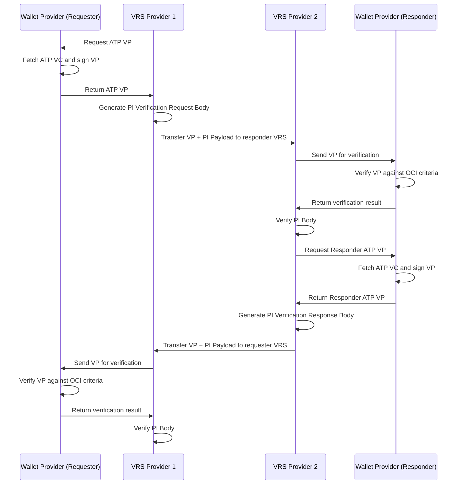
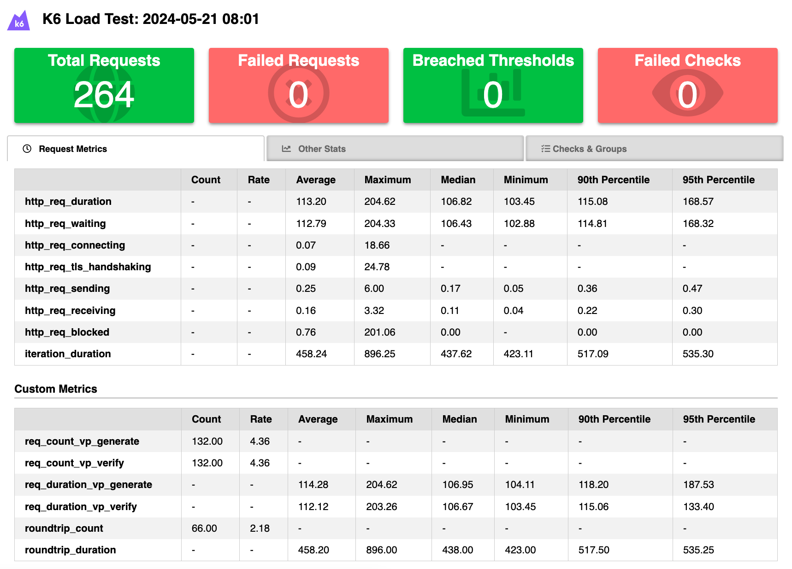

# OCI VRS Performance Testing with k6

This repository contains k6 scripts for performance testing of the OCI VRS criteria between different providers.

## Introduction

[k6](https://k6.io/) is a modern load testing tool, building on Load Impact's years of experience in the load and performance testing industry. It provides a clean, approachable scripting API, local and cloud execution, and flexible configuration.

The script in this repository is specifically designed to test the OCI VRS criteria, ensuring that the system can handle the expected load and perform optimally under stress.

## VRS Flow

This repository contains the basic setup for testing out the VRS flow between different providers. The script will simulate the following flows:



## Setup

To install k6 on your local machine, follow the instructions on the [k6 website](https://k6.io/docs/getting-started/installation/).

After installing k6 you need to adjust the code in the `vrs.js` file to match the correct URLs for the VRS providers. The following environment variables need to be set:

- `WALLET_HOST`: The URL wallet provider host
- `VP_GENERATE_ENDPOINT`: The path to the vp generation endpoint of the wallet host.
- `VP_VERIFY_ENDPOINT`: The path to the vp verification endpoint of the wallet host.
- `REQUESTER_DID`: The DID of the requester.
- `RESPONDER_DID`: The DID of the responder.

You can find the documented flow in the `vrs.js` file.

Additionally you need to implement the call to the PI verification endpoint in the `executeVRSEndpoint` function. This function should call the VRS endpoint which does the PI verification. You can uncomment the code in the function and replace the URL with the correct URL of the PI verification endpoint and adjust the request body to match the expected format of the endpoint. The verifiable presentation is passed as the parameter `vp` to the function, so that you can use the data in the call to the PI verification.

If you need to pass an authorization header to the wallet or VRS endpoints, you can do so by adding the header to the `headers` object in the `executeVRSEndpoint` or in the `generateVp` and `verifyVp` functions in the `utils/wallet.js` file.

```javascript
    {
      headers: {
        'Content-Type': 'application/json'
        'Authorization': 'Bearer <token>'
      }
    }
```

## Running the Tests

To run the tests, execute the following command:

```bash
k6 run vrs.js
```


## Load Testing Scenarios

When the k6 scripts are executed it will use the following specification to execute the tests:

- **VUs**: The number of virtual users that will be used to simulate the load on the system.
- **Duration**: The duration of the test in seconds.
- **Ramp-up time**: The time in seconds that will be used to ramp up the number of virtual users to the specified number.
- **Ramp-down time**: The time in seconds that will be used to ramp down the number of virtual users to 0.

The following stages are executed:

- **Stage 1**: 5 VUs for 30 seconds (ramp-up)
- **Stage 2**: 10 VUs for 30 seconds
- **Stage 3**: 20 VUs for 30 seconds
- **Stage 4**: 40 VUs for 30 seconds (ramp-down for 5 seconds)

## Interpreting the Results

After running the tests, k6 will generate a summary of the test results. These results will be published as an HTML report in the "summary.html" file.

The report will look like this:



In the report itself you can browse through the different metrics that were collected during the test. The most important metrics are:

- **req_count_vp_generate**: The amount of calls which were executed to generate a DSCSAAtpCredential VP.
- **req_count_vp_verify**: The amount of calls which were executed to verify a DSCSAAtpCredential VP.
- **req_count_pi_verify**: The amount of calls which were executed to do the PI verification.
- **req_duration_pi_verify**: The average duration of the calls to do the PI verification.
- **req_duration_vp_generate**: The average duration of the calls to generate a DSCSAAtpCredential VP.
- **req_duration_vp_verify**: The average duration of the calls to verify a DSCSAAtpCredential VP.
- **roundtrip_count**: The amount of roundtrips that were executed during the test.
- **roundtrip_duration**: The average duration of the roundtrips that were executed during the test.

All times which are mentioned in the report are in milliseconds. You can additionally find the Max, Min, 90th and 95th percentile values for each metric.

In the "Checks & Groups" tab you can find the results of the checks that were executed during the test. These checks are used to verify if the responses of the requests are correct. If a check fails, the test will fail. Currently the checks are only used to verify if the status code of the response is 200. If you want to add more checks, you can do so in the script.